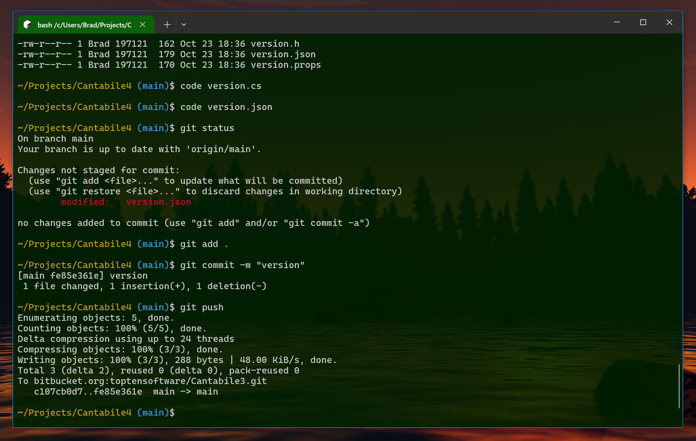

# Bashful

Setting up a nice Bash prompt in Windows.




## Background

Recently I decide to switch to using bash on windows.  After years of mixing Windows/cmd.exe 
and Linux/bash, I decided to settle on one and stick with it... and bash was the obvious choice.

This repo is to remind me how to set it up next time.


## Windows Terminal

Window Terminal is the way to go.  If you don't have, [get it](https://learn.microsoft.com/en-us/windows/terminal/install).


## Git Bash

At first I was going to use bash that comes with Windows, but I think Git Bash is better
configured out of the box.  Here's the changes I made.

1. Run Windows Terminal and open the "Git Bash" profile (if you have git installed the profile
   should already exist).

2. With a text editor (code, vi, whatever...) open (or create) `~/.bashrc` and add the following.
   This changes to a more concise prompt (just path and git status) and makes `ls` list all files,
   in long form, with human readable file sizes.

    ```bash
    export PS1='\[\033]0;bash $PWD\007\]\n\[\033[33m\]\w\[\033[36m\]`__git_ps1`\[\033[0m\]$ '

    alias ls='ls -alh'
    alias gsr='for d in */; do echo $d && git -C $d status --short; done'
    ```

   Or, copy the file from this repository.

   (`gsr` = "git status recursive" will list the git status of all sub-directories of the current directory)

3. With a text editor, open `~/.inputrc` and add the following to:

    * This stops the super annoying  window flash and/or bell, 
    * Enables case insensitive tab completion
    * makes tab completion more like to how cmd.exe tab completion works (which I prefer).
    * allows searching command history by typing the first few letters of a previous command 
      and pressing Page Up/Down.

    ```
    set bell-style none
    set completion-ignore-case On
    TAB: menu-complete
    "\e[Z": menu-complete-backward
    "\e[5~": history-search-backward
    "\e[6~": history-search-forward
    ```

   Or, copy the file from this repository


4. Restart Windows Terminal for changes to take effect.


## Make it Look Better

Now, let's make it look nicer:

1. Start Windows Terminal.
2. Bring up Settings (Ctrl+,) and then Click Open JSON File.  (Or just press Ctrl+Shift+,)
3. Make the changes below

In the root settings section, usually at end of the file before the last closing brace add this:

```json    
"centerOnLaunch": true,
```

Without this Windows Terminal sometimes loads partially offscreen.

In the section `{ "profiles": { "list": [ ] } } `, replace the existing
Git Bash entry with the following (adjust starting directory as appropriate).

The 128x128.png is [available here](https://github.com/odb/official-bash-logo) or copy it from this repository.

```json
"list": 
[
    {
        "colorScheme": "Campbell on Green",
        "commandline": "C:\\Program Files\\Git\\bin\\bash.exe",
        "guid": "{4e6ab04a-722b-4a51-962f-e0d099e44d51}",
        "hidden": false,
        "icon": "C:\\Program Files\\Git\\128x128.png",
        "name": "Bash",
        "opacity": 90,
        "startingDirectory": "C:\\Users\\Brad\\Projects",
        "tabColor": "#0b6008",
        "useAcrylic": false
    },
]
```

In the section `{ "schemes": [ ] } `, section add the following. (This is the default Campbell 
color scheme but with a dark green background).

```json
{
    "background": "#002000",
    "black": "#0C0C0C",
    "blue": "#0037DA",
    "brightBlack": "#767676",
    "brightBlue": "#3B78FF",
    "brightCyan": "#61D6D6",
    "brightGreen": "#16C60C",
    "brightPurple": "#B4009E",
    "brightRed": "#E74856",
    "brightWhite": "#F2F2F2",
    "brightYellow": "#F9F1A5",
    "cursorColor": "#FFFFFF",
    "cyan": "#3A96DD",
    "foreground": "#CCCCCC",
    "green": "#13A10E",
    "name": "Campbell on Green",
    "purple": "#881798",
    "red": "#C50F1F",
    "selectionBackground": "#FFFFFF",
    "white": "#CCCCCC",
    "yellow": "#C19C00"
}
```

Finally, replace the `"defaultProfile"` setting to set the default profile:

```json
"defaultProfile": "{4e6ab04a-722b-4a51-962f-e0d099e44d51}",
```

See `settings.json` in this repo for full file example (but you probably don't want
to just overwrite your file as it likely has other profiles configured that you 
might want to keep).


## Bash on Windows

A couple of tips for working with bash on Windows

* Backslashes in paths are supported sometimes... best to just change habit and start
  using forward slashes everywhere
* Drive letters are available as `/c/` for `c:\` etc...
* `~` is mapped to your home directory (eg: `C:\Users\USERNAME\`)  (Yay!)
* `cd` by itself changes you to your home directory
* Be careful using `cp` & `mv` - if you're not used to them, you can do damage.


## Handy Windows Terminal Shortcuts

Windows Terminal is pretty nice and it's worth learning some of the more useful 
shortcuts: (`Ctrl+Shift+P` to learn more)

* `Alt+Shift+'+'` - split right
* `Alt+Shift+'-'` - split down
* `Ctrl+Shift+W` - close split pane, or current tab if not split
* `Alt+Left/Right/Up/Down` - switch panes
* `Ctrl+Shift+T` - new tab
* `Ctrl+Shift+P` - command palette
* `Ctrl+Shift+Space` - new tab menu
* `Ctrl+Tab`/`Ctrl+Shift+Tab` - switch tabs
* `Ctrl+Shift+M` - toggle mark mode (select for copy)


